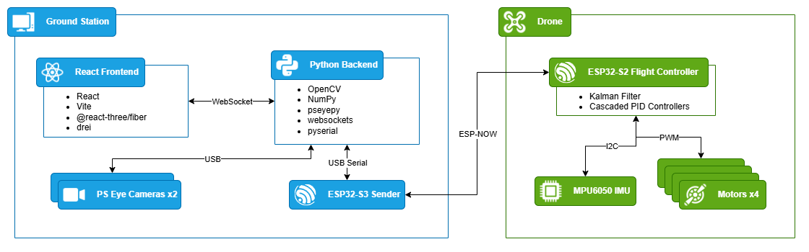

# Final Year Project

This repository contains the `MoCap` project, split into a Python backend, a React frontend, and an ESP32-S3 serial receiver sketch.

## Architecture

See [Architecture Diagram](docs/architecture-diagram.md) for a GitHub-rendered system diagram covering the host computer, cameras, USB/ESP-NOW bridge, and drone-side controller stack.



## Structure

- `backend/`: motion-capture logic, camera calibration files, and the main tracking server in `index.py`
- `frontend/`: Vite + React client for activation, serial selection, and PID input
- `esp32-s3-sender/`: Arduino sketch for the ESP32-S3 USB serial receiver and ESP-NOW transmitter
- `esp32-s2-drone/`: Arduino sketch for the ESP32-S2 ESP-NOW receiver

## Backend

The backend in `backend/index.py` uses OpenCV, NumPy, `pseyepy`, `websockets`, and `pyserial` to:

- load camera intrinsics and extrinsics from `backend/calibration/`
- verify that the configured cameras are connected before allowing transmission
- detect LED points from the configured camera feeds
- estimate 3D pose from multi-view triangulation
- accept activation, serial settings, and PID values from the frontend over WebSocket
- stream `droneIndex + compact JSON + newline` frames to the ESP32-S3 over the selected serial port only when the camera and serial gates are both ready

Install the required Python packages in your environment before running it.

## Frontend

The frontend is a Vite app in `frontend/`.

Typical commands:

```bash
cd frontend
npm install
npm run dev
```

The UI connects to `ws://localhost:8765` and owns all operator input:

- serial port selection
- baud rate
- stream activation and motor arming
- target `x`, `y`, `z`, and `yaw` hover coordinates
- outer-loop PID parameters for `x`, `y`, `z`, and `yaw`
- inner-loop PID parameters for `roll`, `pitch`, and `yaw rate`
- hover throttle and attitude limits

## ESP32 boards

Flash `esp32-s3-sender/esp32-s3-sender.ino` to the ESP32-S3. It listens for `droneIndex + JSON + newline` frames from the Python server over USB serial, strips the leading index byte, and forwards the JSON body to the matching ESP32-S2 peer over ESP-NOW.

Flash `esp32-s2-drone/esp32-s2-drone.ino` to the ESP32-S2. It receives ESP-NOW messages, estimates attitude from the onboard MPU6050, and runs a hover-oriented control loop for the brushed motor outputs.

Setup notes:

- Open the ESP32-S2 serial monitor once after flashing and note the printed station MAC address.
- Copy that MAC address into `DRONE_MAC_ADDRESSES` in `esp32-s3-sender/esp32-s3-sender.ino`.
- Index `0` in `DRONE_MAC_ADDRESSES` currently matches the backend's default `droneIndex` value.
- ESP-NOW payloads in this implementation are capped at the official 250-byte ESP-NOW limit.

## Run flow

1. Start the Python backend from the repository root: `python backend/index.py`
2. Start the frontend from `frontend/`: `npm run dev`
3. Connect the ESP32-S3 to the computer over USB
4. Open the frontend, refresh serial ports, choose the ESP32-S3 COM port, enter PID values, and activate the stream
5. The backend will only send payloads when the required cameras are connected and pose tracking is ready

## Notes

- `frontend/node_modules/` is intentionally ignored and should not be committed.
- Calibration assets under `backend/calibration/` are currently tracked in the repository.
