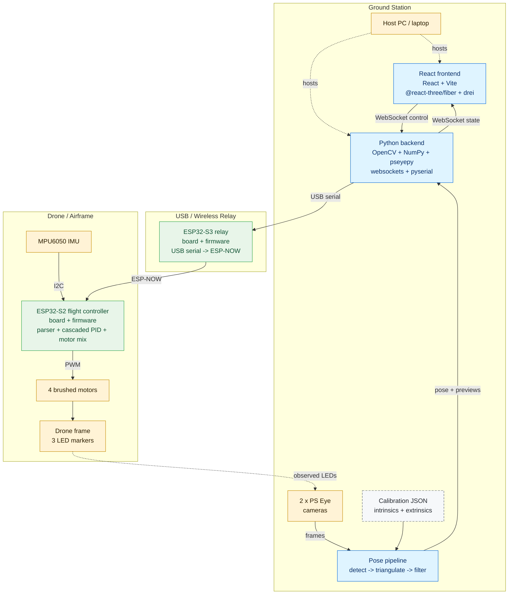

# Architecture Diagram

This diagram reflects the current implementation in the repository:

- the ground station runs the React frontend and Python backend on the host computer
- the current backend code is configured for **2 cameras**
- the ESP32-S3 acts as a USB-to-ESP-NOW relay, while the ESP32-S2 runs the onboard hover controller

## Component Notes

- `frontend/src/App.jsx`: browser-based operator console for stream control, arming, targets, PID tuning, telemetry, camera previews, and 3D scene view
- `backend/index.py`: WebSocket server, motion-capture pipeline, state broadcast, serial bridge, and compact control-payload builder
- `esp32-s3-sender/esp32-s3-sender.ino`: implementation behind the ESP32-S3 relay node that bridges USB serial to ESP-NOW
- `esp32-s2-drone/esp32-s2-drone.ino`: implementation behind the ESP32-S2 flight-controller node that parses commands, estimates attitude, and drives the motors

## Reuse

- GitHub will render the Mermaid block directly in this Markdown file
- the raw Mermaid source is available in `docs/architecture-diagram.mmd` if you want to export it as SVG or PNG for your final report
